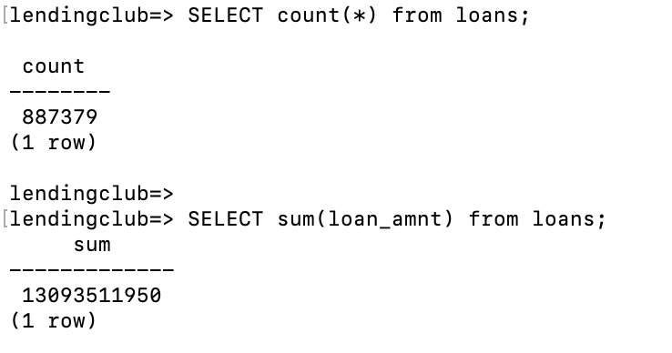

# LendingClub EDA and Pipeline

# Contents

1. [Summary](README.md#Summary)
2. [Assumptions](README.md#Assumptions)
3. [Approach](README.md#Approach)
4. [How to start](README.md#how-to-start)
5. [Future Directions](README.md#Future-directions)

# Summary
* The first task is to complete Exploratory Data Analysis for Kaggle LendingClub dataset.
* The second task is to build the prototype of a data pipeline to feed a data warehouse with data of this dataset. 
* The data was downloaded from [Kaggle](https://www.kaggle.com/wndykan/lending-club-data). 
* The data warehouse will allow data scientists and data analysts to interactively query and explore.
* The data warehouse can also be used as a foundation for machine learning model development.

# Assumptions

* The data can be downloaded in the form of a CSV file. 
* No duplicate records of loans in the future, as what we haven confirmed in EDA part
* Data Validation and cleaning are in general, since no specific usage was defined.
* The data pipeline need to automatically ingest the dataset into data warehouse.
* Database need be periodically updated.
* All packages in requirement.txt are installed

# Approach

## Language

Python 3.7

## Database

PostgreSQL (currently on local machine)

## EDA

The EDA of this dataset was given as EDA_notebook/lc_analysis.ipynb

## Data Pipeline

#### 1. Input

- Input is a single csv file named 'loan.csv' under input folder

#### 2. Schema Design

- Assume this dataset is for convenience of analyst to complete data visualization and statistics calculation, a single table contains all columns is better.
- Table 'loans' contains all columns we get from raw data
- Detailed Scheme is defined in pipeline_src/database.sql

#### 3. Data cleaning and validation using python

- We create python functions to convert variable type, format date time columns and consider possible missing imputation.
- Pandas is mostly used to complete our cleaning task.

#### 4. Write cleaned data into PostgreSQL database

- We use sqlalchemy to create engine, and use df.to_sql function to write the dataframe into table.

#### 5. Output

- The output is a postgresql database with processed data
- For instance, the output can be a database named 'lendingclub', within the database, we have a table named 'loans'.
- Sample queries using the output: 

# How to start

To download, clone this repository first.

Before execute, use the pipeline_src/database.sql as a reference to config the database locally.

To execute, run  `bash pipeline_src/run.sh`.

To run test, run `bash tests/run_test.sh`.

# Future Directions

* Given detailed use cases, schema should be redesigned. For example, to avoid information leakage, variables only available after loans are issued should not be used during modeling, a consideration is that they can be stored in a separate table in our database. 
* Using StringIO to save dataframe in memory instead of using df.to_sql with chunk size to reduce writing time
* Create more tests to cover more edge case in order to provide more robust data pipeline
* Develop data process functions that can process the data for further machine learning modeling (e.g. Outlier detecion and removal, accurate missing imputation, one-hot encoding for categorical variables)
* Currently, we are using postgresql database on localhost, considering the data size is not huge, AWS RDS free-tier can be an alternative.